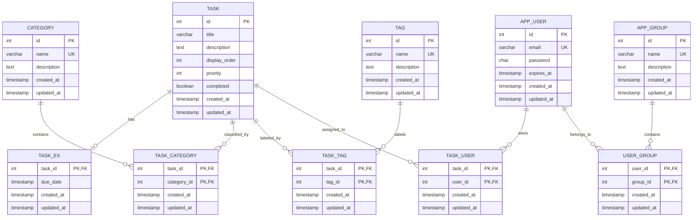

# TodoList REST API - バックエンド構造とエンドポイント

## プロジェクト概要
- **言語**: Java 25
- **フレームワーク**: Spring Boot 3.5.5
- **ビルドツール**: Maven
- **データベース**: PostgreSQL
- **ORM**: Spring Data JPA

## プロジェクト構成

```
todolist/
├── docker-compose.yml                                # PostgreSQLとAPIのコンテナ定義
├── initdb.sql                                         # DB初期化スクリプト
├── DOCKER_SETUP.md                                    # Docker実行手順
├── backend/
│   ├── Dockerfile                                     # Spring Bootイメージ定義
│   ├── .dockerignore                                  # Dockerビルド除外設定
│   ├── pom.xml                                        # Maven設定
│   ├── README.md                                      # APIセットアップガイド
│   └── src/
│       ├── main/
│       │   ├── java/com/example/todolist/
│       │   │   ├── TodolistApplication.java           # エントリポイント
│       │   │   ├── controller/                        # REST API
│       │   │   │   ├── AuthController.java
│       │   │   │   ├── TaskController.java
│       │   │   │   ├── CategoryController.java
│       │   │   │   ├── TagController.java
│       │   │   │   ├── AppUserController.java
│       │   │   │   └── AppGroupController.java
│       │   │   ├── service/                            # ビジネスロジック
│       │   │   │   ├── TaskService.java
│       │   │   │   ├── CategoryService.java
│       │   │   │   ├── TagService.java
│       │   │   │   ├── AppUserService.java
│       │   │   │   └── AppGroupService.java
│       │   │   ├── repository/                        # データアクセス
│       │   │   │   ├── TaskRepository.java
│       │   │   │   ├── CategoryRepository.java
│       │   │   │   ├── TagRepository.java
│       │   │   │   ├── AppUserRepository.java
│       │   │   │   └── AppGroupRepository.java
│       │   │   ├── entity/                            # JPAエンティティ
│       │   │   │   ├── Task.java
│       │   │   │   ├── TaskEx.java
│       │   │   │   ├── Category.java
│       │   │   │   ├── Tag.java
│       │   │   │   ├── AppUser.java
│       │   │   │   └── AppGroup.java
│       │   │   ├── dto/                               # API入出力DTO
│       │   │   │   ├── TaskRequest.java / TaskResponse.java
│       │   │   │   ├── CategoryRequest.java / CategoryResponse.java
│       │   │   │   ├── TagRequest.java / TagResponse.java
│       │   │   │   ├── LoginRequest.java
│       │   │   │   ├── UserRequest.java / UserResponse.java
│       │   │   │   └── GroupRequest.java / GroupResponse.java
│       │   │   └── exception/                          # APIエラー処理
│       │   │       ├── LoginRequiredException.java
│       │   │       └── ApiExceptionHandler.java
│       │   └── resources/
│       │       └── application.properties              # PostgreSQL/JPA設定
│       └── test/java/com/example/todolist/             # JUnit/MockMvcテスト
│           ├── controller/                             # Controllerテスト3種
│           └── service/                                # Serviceテスト3種
├── ddl/                                                # DBスキーマ定義
│   ├── task.sql
│   ├── task_ex.sql
│   ├── category.sql
│   ├── tag.sql
│   ├── task_category.sql
│   ├── task_tag.sql
│   ├── user.sql
│   ├── group.sql
│   ├── task_user.sql
│   └── user_group.sql
└── backend-structure-and-endpoints.md                  # 構成/API/ER図/クラス図
```

## エンティティ（Entity）設計

### Task（タスク基本情報）
| カラム | 型 | 説明 |
|--------|------|------|
| id | SERIAL (PK) | タスク一意識別子 |
| title | VARCHAR(255) NOT NULL | タスク名 |
| description | TEXT | タスク説明 |
| display_order | INTEGER | 表示順序 |
| priority | INTEGER | 優先度（0-5） |
| completed | BOOLEAN | 完了状態 |
| created_at | TIMESTAMP | 作成日時 |
| updated_at | TIMESTAMP | 更新日時 |

### TaskEx（タスク拡張情報）
| カラム | 型 | 説明 |
|--------|------|------|
| task_id | INTEGER (FK, PK) | タスクID（Task テーブルへの外部キー） |
| due_date | TIMESTAMP | 期限日時 |
| created_at | TIMESTAMP | 作成日時 |
| updated_at | TIMESTAMP | 更新日時 |

### Category（カテゴリ）
| カラム | 型 | 説明 |
|--------|------|------|
| id | SERIAL (PK) | カテゴリ一意識別子 |
| name | VARCHAR(100) NOT NULL | カテゴリ名 |
| description | TEXT | カテゴリ説明 |
| created_at | TIMESTAMP | 作成日時 |
| updated_at | TIMESTAMP | 更新日時 |

### Tag（タグ）
| カラム | 型 | 説明 |
|--------|------|------|
| id | SERIAL (PK) | タグ一意識別子 |
| name | VARCHAR(100) NOT NULL | タグ名 |
| description | TEXT | タグ説明 |
| created_at | TIMESTAMP | 作成日時 |
| updated_at | TIMESTAMP | 更新日時 |

## ER図



### リレーション概要

| リレーション | 種類 | 説明 |
|---|---|---|
| `TASK` - `TASK_EX` | 1対0..1 | タスクの期限情報を保持 |
| `TASK` - `CATEGORY` | 多対多 | `TASK_CATEGORY`で関連付け |
| `TASK` - `TAG` | 多対多 | `TASK_TAG`で関連付け |
| `TASK` - `APP_USER` | 多対多 | `TASK_USER`で担当・所有関係を保持 |
| `APP_USER` - `APP_GROUP` | 多対多 | `USER_GROUP`で所属関係を保持 |

## クラス図

```mermaid
classDiagram
  class TaskController {
    -TaskService taskService
    +getAllTasks()
    +getTaskById(Long id)
    +getCompletedTasks(Boolean completed)
    +createTask(TaskRequest request)
    +updateTask(Long id, TaskRequest request)
    +deleteTask(Long id)
  }

  class CategoryController {
    -CategoryService categoryService
    +getAllCategories()
    +getCategoryById(Long id)
    +createCategory(CategoryRequest request)
    +updateCategory(Long id, CategoryRequest request)
    +deleteCategory(Long id)
  }

  class TagController {
    -TagService tagService
    +getAllTags()
    +getTagById(Long id)
    +createTag(TagRequest request)
    +updateTag(Long id, TagRequest request)
    +deleteTag(Long id)
  }

  class AuthController {
    -AppUserService userService
    +login(LoginRequest request)
  }

  class AppUserController {
    -AppUserService userService
    +getAllUsers()
    +getUserById(Long id)
    +createUser(UserRequest request)
    +updateUser(Long id, UserRequest request)
    +deleteUser(Long id)
    +addUserToGroup(Long userId, Long groupId)
    +removeUserFromGroup(Long userId, Long groupId)
    +assignTaskToUser(Long userId, Long taskId)
    +unassignTaskFromUser(Long userId, Long taskId)
  }

  class AppGroupController {
    -AppGroupService groupService
    +getAllGroups()
    +getGroupById(Long id)
    +createGroup(GroupRequest request)
    +updateGroup(Long id, GroupRequest request)
    +deleteGroup(Long id)
  }

  class TaskService {
    -TaskRepository taskRepository
    +getAllTasks()
    +getTaskById(Long id)
    +getTasksByCompleted(Boolean completed)
    +createTask(TaskRequest request)
    +updateTask(Long id, TaskRequest request)
    +deleteTask(Long id)
  }

  class CategoryService {
    -CategoryRepository categoryRepository
    +getAllCategories()
    +getCategoryById(Long id)
    +createCategory(CategoryRequest request)
    +updateCategory(Long id, CategoryRequest request)
    +deleteCategory(Long id)
  }

  class TagService {
    -TagRepository tagRepository
    +getAllTags()
    +getTagById(Long id)
    +createTag(TagRequest request)
    +updateTag(Long id, TagRequest request)
    +deleteTag(Long id)
  }

  class AppUserService {
    -AppUserRepository userRepository
    -AppGroupRepository groupRepository
    -TaskRepository taskRepository
    +login(LoginRequest request)
    +getAllUsers()
    +getUserById(Long id)
    +createUser(UserRequest request)
    +updateUser(Long id, UserRequest request)
    +deleteUser(Long id)
    +addUserToGroup(Long userId, Long groupId)
    +removeUserFromGroup(Long userId, Long groupId)
    +assignTaskToUser(Long userId, Long taskId)
    +unassignTaskFromUser(Long userId, Long taskId)
  }

  class AppGroupService {
    -AppGroupRepository groupRepository
    +getAllGroups()
    +getGroupById(Long id)
    +createGroup(GroupRequest request)
    +updateGroup(Long id, GroupRequest request)
    +deleteGroup(Long id)
  }

  class TaskRepository {
    <<interface>>
    +findAllByCompleted(Boolean completed)
  }
  class CategoryRepository {
    <<interface>>
  }
  class TagRepository {
    <<interface>>
  }
  class AppUserRepository {
    <<interface>>
    +findByEmail(String email)
  }
  class AppGroupRepository {
    <<interface>>
  }

  class Task {
    +Long id
    +String title
    +String description
    +Integer displayOrder
    +Integer priority
    +Boolean completed
    +Set~Category~ categories
    +Set~Tag~ tags
  }
  class TaskEx {
    +Long taskId
    +Task task
    +LocalDateTime dueDate
  }
  class Category {
    +Long id
    +String name
    +String description
  }
  class Tag {
    +Long id
    +String name
    +String description
  }
  class AppUser {
    +Long id
    +String email
    -String password
    +LocalDateTime expiresAt
    +Set~AppGroup~ groups
    +Set~Task~ tasks
  }
  class AppGroup {
    +Long id
    +String name
    +String description
    +Set~AppUser~ users
  }

  class TaskRequest
  class TaskResponse
  class CategoryRequest
  class CategoryResponse
  class TagRequest
  class TagResponse
  class LoginRequest
  class UserRequest
  class UserResponse
  class GroupRequest
  class GroupResponse

  class LoginRequiredException {
    <<exception>>
  }
  class ApiExceptionHandler {
    +handleLoginRequired(LoginRequiredException exception)
  }

  TaskController --> TaskService
  CategoryController --> CategoryService
  TagController --> TagService
  AuthController --> AppUserService
  AppUserController --> AppUserService
  AppGroupController --> AppGroupService

  TaskService --> TaskRepository
  CategoryService --> CategoryRepository
  TagService --> TagRepository
  AppUserService --> AppUserRepository
  AppUserService --> AppGroupRepository
  AppUserService --> TaskRepository
  AppGroupService --> AppGroupRepository

  TaskService ..> TaskRequest
  TaskService ..> TaskResponse
  CategoryService ..> CategoryRequest
  CategoryService ..> CategoryResponse
  TagService ..> TagRequest
  TagService ..> TagResponse
  AppUserService ..> LoginRequest
  AppUserService ..> UserRequest
  AppUserService ..> UserResponse
  AppGroupService ..> GroupRequest
  AppGroupService ..> GroupResponse

  TaskRepository ..> Task
  CategoryRepository ..> Category
  TagRepository ..> Tag
  AppUserRepository ..> AppUser
  AppGroupRepository ..> AppGroup

  Task "1" *-- "0..1" TaskEx
  Task "0..*" -- "0..*" Category
  Task "0..*" -- "0..*" Tag
  AppUser "0..*" -- "0..*" Task
  AppUser "0..*" -- "0..*" AppGroup
  ApiExceptionHandler ..> LoginRequiredException
  AppUserService ..> LoginRequiredException
```



### クラス図のレイヤー

| レイヤー | 対象クラス | 役割 |
|---|---|---|
| Controller | `*Controller` | HTTPリクエストの受付とレスポンス返却 |
| Service | `*Service` | CRUD、ログイン判定、関連付け処理 |
| Repository | `*Repository` | Spring Data JPAによるDBアクセス |
| Entity | `Task`、`TaskEx`、`Category`、`Tag`、`AppUser`、`AppGroup` | DBテーブルとのマッピング |
| DTO | `*Request`、`*Response` | API入出力のデータ形式 |
| Exception | `LoginRequiredException`、`ApiExceptionHandler` | 認証エラーの401応答 |

## REST API エンドポイント

### Task API

#### 1. 全タスク取得
```
GET /api/v1/tasks
```
**説明**: 全てのタスクをリスト表示
**レスポンス**: 200 OK
```json
[
  {
    "id": 1,
    "title": "タスク1",
    "description": "説明",
    "displayOrder": 0,
    "priority": 1,
    "completed": false,
    "dueDate": "2024-12-31T23:59:59",
    "categoryIds": [1],
    "tagIds": [1],
    "createdAt": "2024-09-02T10:00:00",
    "updatedAt": "2024-09-02T10:00:00"
  }
]
```

#### 2. 特定タスク取得
```
GET /api/v1/tasks/{id}
```
**説明**: 指定されたIDのタスクを取得
**パラメータ**: `id` - タスクID（パス変数）
**レスポンス**: 200 OK（上記の単一オブジェクト）

#### 3. 完了状態でフィルター
```
GET /api/v1/tasks/filter/completed?completed=true|false
```
**説明**: 完了/未完了のタスクをフィルター
**パラメータ**: `completed` - true|false（クエリパラメータ）
**レスポンス**: 200 OK（配列）

#### 4. タスク作成
```
POST /api/v1/tasks
Content-Type: application/json
```
**説明**: 新しいタスクを作成
**リクエストボディ**:
```json
{
  "title": "新規タスク",
  "description": "説明（省略可）",
  "displayOrder": 0,
  "priority": 0,
  "completed": false,
  "dueDate": "2024-12-31T23:59:59",
  "categoryIds": [1],
  "tagIds": [1]
}
```
**レスポンス**: 201 Created

#### 5. タスク更新
```
PUT /api/v1/tasks/{id}
Content-Type: application/json
```
**説明**: 指定されたタスクを更新
**パラメータ**: `id` - タスクID（パス変数）
**リクエストボディ**: TaskRequest（上記参照）
**レスポンス**: 200 OK

#### 6. タスク削除
```
DELETE /api/v1/tasks/{id}
```
**説明**: 指定されたタスクを削除
**パラメータ**: `id` - タスクID（パス変数）
**レスポンス**: 204 No Content

---

### 認証 API

#### 1. ログイン
```
POST /api/v1/auth/login
Content-Type: application/json
```
**説明**: メールアドレス、パスワード、有効期限を検証してログインする
**リクエストボディ**:
```json
{
  "email": "user@example.com",
  "password": "password"
}
```
**レスポンス**: 200 OK（`UserResponse`。パスワードは含まない）

`expires_at` がNULL、または現在時刻以前の場合はログイン不可です。
ログイン不可の場合は、ログイン画面を表示するための情報として次を返します。

```json
HTTP/1.1 401 Unauthorized
{
  "code": "LOGIN_REQUIRED",
  "message": "Login is required",
  "timestamp": "2026-09-03T10:00:00Z"
}
```

パスワード不一致、ユーザー不存在の場合も同じ401レスポンスを返します。

---

### User API

#### 1. 全ユーザー取得
```
GET /api/v1/users
```
**レスポンス**: 200 OK（ユーザー一覧。パスワードは含まない）

#### 2. 特定ユーザー取得
```
GET /api/v1/users/{id}
```
**レスポンス**: 200 OK

#### 3. ユーザー作成
```
POST /api/v1/users
Content-Type: application/json
```
**リクエストボディ**:
```json
{
  "email": "user@example.com",
  "password": "password",
  "expiresAt": "2026-12-31T23:59:59"
}
```
**レスポンス**: 201 Created

#### 4. ユーザー更新
```
PUT /api/v1/users/{id}
Content-Type: application/json
```
**レスポンス**: 200 OK

#### 5. ユーザー削除
```
DELETE /api/v1/users/{id}
```
**レスポンス**: 204 No Content

#### 6. ユーザーをグループへ追加
```
POST /api/v1/users/{userId}/groups/{groupId}
```
**レスポンス**: 204 No Content

#### 7. ユーザーをグループから削除
```
DELETE /api/v1/users/{userId}/groups/{groupId}
```
**レスポンス**: 204 No Content

#### 8. タスクをユーザーへ割り当て
```
POST /api/v1/users/{userId}/tasks/{taskId}
```
**レスポンス**: 204 No Content

#### 9. ユーザーからタスクの割り当てを解除
```
DELETE /api/v1/users/{userId}/tasks/{taskId}
```
**レスポンス**: 204 No Content

---

### Group API

#### 1. 全グループ取得
```
GET /api/v1/groups
```
**レスポンス**: 200 OK

#### 2. 特定グループ取得
```
GET /api/v1/groups/{id}
```
**レスポンス**: 200 OK

#### 3. グループ作成
```
POST /api/v1/groups
Content-Type: application/json
```
**リクエストボディ**:
```json
{
  "name": "開発チーム",
  "description": "開発担当グループ"
}
```
**レスポンス**: 201 Created

#### 4. グループ更新
```
PUT /api/v1/groups/{id}
Content-Type: application/json
```
**レスポンス**: 200 OK

#### 5. グループ削除
```
DELETE /api/v1/groups/{id}
```
**レスポンス**: 204 No Content

---

### Category API

#### 1. 全カテゴリ取得
```
GET /api/v1/categories
```
**説明**: 全てのカテゴリをリスト表示
**レスポンス**: 200 OK
```json
[
  {
    "id": 1,
    "name": "カテゴリ名",
    "description": "説明",
    "createdAt": "2024-09-02T10:00:00",
    "updatedAt": "2024-09-02T10:00:00"
  }
]
```

#### 2. 特定カテゴリ取得
```
GET /api/v1/categories/{id}
```
**説明**: 指定されたIDのカテゴリを取得
**パラメータ**: `id` - カテゴリID（パス変数）
**レスポンス**: 200 OK

#### 3. カテゴリ作成
```
POST /api/v1/categories
Content-Type: application/json
```
**説明**: 新しいカテゴリを作成
**リクエストボディ**:
```json
{
  "name": "新規カテゴリ",
  "description": "説明（省略可）"
}
```
**レスポンス**: 201 Created

#### 4. カテゴリ更新
```
PUT /api/v1/categories/{id}
Content-Type: application/json
```
**説明**: 指定されたカテゴリを更新
**パラメータ**: `id` - カテゴリID（パス変数）
**リクエストボディ**: CategoryRequest
**レスポンス**: 200 OK

#### 5. カテゴリ削除
```
DELETE /api/v1/categories/{id}
```
**説明**: 指定されたカテゴリを削除
**パラメータ**: `id` - カテゴリID（パス変数）
**レスポンス**: 204 No Content

---

### Tag API

#### 1. 全タグ取得
```
GET /api/v1/tags
```
**説明**: 全てのタグをリスト表示
**レスポンス**: 200 OK
```json
[
  {
    "id": 1,
    "name": "タグ名",
    "description": "説明",
    "createdAt": "2024-09-02T10:00:00",
    "updatedAt": "2024-09-02T10:00:00"
  }
]
```

#### 2. 特定タグ取得
```
GET /api/v1/tags/{id}
```
**説明**: 指定されたIDのタグを取得
**パラメータ**: `id` - タグID（パス変数）
**レスポンス**: 200 OK

#### 3. タグ作成
```
POST /api/v1/tags
Content-Type: application/json
```
**説明**: 新しいタグを作成
**リクエストボディ**:
```json
{
  "name": "新規タグ",
  "description": "説明（省略可）"
}
```
**レスポンス**: 201 Created

#### 4. タグ更新
```
PUT /api/v1/tags/{id}
Content-Type: application/json
```
**説明**: 指定されたタグを更新
**パラメータ**: `id` - タグID（パス変数）
**リクエストボディ**: TagRequest
**レスポンス**: 200 OK

#### 5. タグ削除
```
DELETE /api/v1/tags/{id}
```
**説明**: 指定されたタグを削除
**パラメータ**: `id` - タグID（パス変数）
**レスポンス**: 204 No Content

---

## アーキテクチャレイヤー

### 1. Controller レイヤー
- HTTP リクエストの受け取り
- リクエスト/レスポンスの処理
- CORS 対応

### 2. Service レイヤー
- ビジネスロジックの実装
- トランザクション管理（`@Transactional`）
- エンティティとDTO間の変換

### 3. Repository レイヤー
- Spring Data JPA を使用したデータベースアクセス
- CRUD 操作の抽象化

### 4. Entity レイヤー
- JPA アノテーションを使用したデータベースマッピング
- ライフサイクルコールバック（`@PrePersist`, `@PreUpdate`）

### 5. DTO レイヤー
- リクエスト/レスポンスのデータ構造定義
- バリデーション（`@NotBlank` など）

## 設定

### application.properties
```properties
# Server
spring.application.name=todolist-api
server.port=8080

# Database
spring.datasource.url=jdbc:postgresql://localhost:5432/todolist
spring.datasource.username=postgres
spring.datasource.password=postgres
spring.datasource.driver-class-name=org.postgresql.Driver

# JPA
spring.jpa.hibernate.ddl-auto=validate
spring.jpa.show-sql=false
spring.jpa.properties.hibernate.dialect=org.hibernate.dialect.PostgreSQLDialect
spring.jpa.properties.hibernate.format_sql=true

# Logging
logging.level.root=INFO
logging.level.com.example.todolist=DEBUG
```

## Maven 依存関係

- `spring-boot-starter-web` - Web API 開発
- `spring-boot-starter-data-jpa` - データベースアクセス
- `spring-boot-starter-validation` - バリデーション
- `postgresql` - PostgreSQL ドライバー
- `lombok` - ボイラープレートコード削減
- `spring-boot-starter-test` - テスト

## セットアップおよび実行手順

### 1. データベース準備
```bash
# PostgreSQL に接続
psql -U postgres

# データベース作成
CREATE DATABASE todolist;

# スキーマ実行
\c todolist
\i path/to/ddl/task.sql
\i path/to/ddl/task_ex.sql
\i path/to/ddl/category.sql
```

### 2. ビルド
```bash
cd backend
mvn clean install
```

### 3. アプリケーション実行
```bash
mvn spring-boot:run
```

アプリケーションは `http://localhost:8080` で起動します。

## トランザクション管理

- `@Transactional(readOnly = true)` - 読み取り専用トランザクション
- `@Transactional` - 書き込みトランザクション
- 自動的にロールバック機能が有効

## エラーハンドリング

`LoginRequiredException` は `ApiExceptionHandler` により、401と `LOGIN_REQUIRED` を返します。
その他の例外については、今後Global Exception Handlerの対象を拡張します。

## 将来の拡張機能

- [x] Global Exception Handler の実装（ログイン要求エラー）
- [x] ログイン・認証機能（有効期限チェック、401 LOGIN_REQUIRED応答）
- [ ] ページネーション
- [ ] 高度なフィルター（複数条件検索）
- [ ] バッチ処理
- [ ] 監査ログ
- [x] ユニットテスト・Controllerテスト
- [ ] API ドキュメント（Swagger/OpenAPI）
- [ ] キャッシング機構
- [ ] イベント駆動設計
