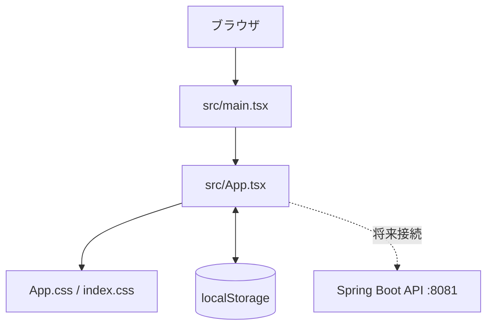

# TodoList フロントエンド構成

## 概要

TodoList の React + TypeScript フロントエンドです。Vite を開発・ビルド基盤として使用し、タスク管理用のワークスペース画面を提供します。

- **フレームワーク**: React 19
- **言語**: TypeScript
- **ビルドツール**: Vite
- **アイコン**: lucide-react
- **フォント**: DM Sans / Source Sans 3
- **開発サーバー**: `http://localhost:5173`
- **API**: Spring Boot バックエンド `http://localhost:8081`
- **永続化**: 現在はブラウザの `localStorage`

## ディレクトリ構成

```text
frontend/
├── Dockerfile                 # Vite 開発サーバー用コンテナ
├── index.html                 # HTML エントリーポイント
├── package.json               # npm scripts と依存関係
├── package-lock.json          # 依存関係ロックファイル
├── vite.config.ts             # Vite 設定
├── tsconfig.json              # TypeScript プロジェクト設定
├── tsconfig.app.json          # アプリケーション用 TypeScript 設定
├── tsconfig.node.json         # Vite 設定用 TypeScript 設定
├── .oxlintrc.json             # Oxlint 設定
├── public/
│   ├── favicon.svg            # ブラウザ用 favicon
│   └── icons.svg              # 公開 SVG リソース
└── src/
    ├── main.tsx               # React アプリケーションの起動
    ├── App.tsx                # タスクワークスペースと状態管理
    ├── App.css                # アプリケーションのレイアウト・テーマ
    ├── index.css              # グローバル CSS とフォント
    └── assets/                # Vite 生成時の静的アセット
```

## アプリケーション構成



### エントリーポイント

`src/main.tsx` が `#root` に React アプリケーションをマウントします。`StrictMode` を有効にし、グローバル CSS と `App` を読み込みます。

### メイン画面

`src/App.tsx` は現在、以下の UI とロジックを担当します。

- ヘッダーとブランド表示
- サイドバーによるビュー切り替え
- 受信トレイ、今日、完了済み、カテゴリ表示
- タスクの追加、完了・未完了切り替え、削除
- タスク検索
- 期限、優先度、作成日による並び替え
- ライト / ダークテーマ切り替え
- `localStorage` へのタスク保存
- モバイル用サイドバー開閉

内部では次の型を使用しています。

- `Priority`: `高`、`中`、`低`
- `Task`: ID、タイトル、カテゴリ、タグ、優先度、期限、完了状態

## 画面レイアウト

```text
┌──────────────────────────────────────────────┐
│ todolist                         テーマ  SK  │
├──────────────┬───────────────────────────────┤
│ WORKSPACE    │ OVERVIEW                      │
│ 受信トレイ   │ 受信トレイ                    │
│ 今日         │ 新しいタスクを追加            │
│ 完了済み     │ 検索 / 並び替え / 絞り込み     │
│              │                                │
│ COLLECTIONS  │ 進行中のタスク                │
│ 仕事         │ 完了済みのタスク              │
│ 個人         │                                │
│              │                                │
│ TAGS         │                                │
└──────────────┴───────────────────────────────┘
```

### デスクトップ

- 左側に幅 244px のナビゲーションを表示
- 中央に最大幅 920px のタスクワークスペースを表示
- ヘッダーは画面上部に固定サイズで表示
- タスクは一覧形式で、優先度・カテゴリ・期限を横並び表示

### モバイル

- サイドバーをドロワーとして表示
- ヘッダーのメニューボタンでサイドバーを開閉
- タスクの期限やタグは画面幅に応じて簡略表示
- タスク追加欄と検索欄は縦方向に折り返し

## 状態管理

現在は `App.tsx` の React Hooks で管理しています。

| 状態 | 用途 |
|------|------|
| `tasks` | タスク一覧。初期値は `localStorage` またはサンプルデータ |
| `query` | 検索文字列 |
| `filter` | 現在のビューまたはカテゴリ |
| `sort` | 期限、優先度、作成日の並び順 |
| `newTitle` | 新規タスクのタイトル |
| `newPriority` | 新規タスクの優先度 |
| `newCategory` | 新規タスクのカテゴリ |
| `isDark` | ダークテーマの有効状態 |
| `sidebarOpen` | サイドバーの表示状態 |

タスク一覧は `todolist-tasks` というキーで保存されます。

## 操作フロー

1. クイック追加欄にタイトルを入力する
2. 優先度とカテゴリを選択する
3. `追加` または Enter キーでタスクを作成する
4. チェックボックスで完了状態を切り替える
5. タスク行のメニューから削除する
6. 検索欄、ビュー、並び順で表示対象を絞り込む

## Docker Compose

ルートの `docker-compose.yml` からフロントエンドを起動できます。

```powershell
docker compose up --build frontend
```

またはバックエンドとデータベースを含めて起動します。

```powershell
docker compose up --build
```

| サービス | URL | 役割 |
|----------|-----|------|
| `frontend` | `http://localhost:5173` | Vite 開発サーバー |
| `app` | `http://localhost:8081` | Spring Boot REST API |
| `postgres` | `localhost:5433` | PostgreSQL |

`frontend/Dockerfile` は Node.js 22 Alpine を使用し、Vite を `0.0.0.0:5173` で公開します。

## npm コマンド

```powershell
npm install       # 依存関係をインストール
npm run dev       # 開発サーバーを起動
npm run build     # TypeScript チェックと本番ビルド
npm run lint      # Oxlint を実行
npm run preview   # 本番ビルドをプレビュー
```

## 今後の拡張方針

現在は画面と状態管理が `App.tsx` に集約されています。API 連携を実装する段階では、次のように分割すると保守しやすくなります。

```text
src/
├── components/
│   ├── AppHeader.tsx
│   ├── Sidebar.tsx
│   ├── QuickAdd.tsx
│   ├── TaskToolbar.tsx
│   ├── TaskList.tsx
│   └── TaskRow.tsx
├── hooks/
│   └── useTasks.ts
├── services/
│   └── taskApi.ts
├── types/
│   └── task.ts
└── App.tsx
```

API を接続する場合は、バックエンドを正本とし、`localStorage` は一時キャッシュまたはオフライン時のフォールバックとして扱います。
